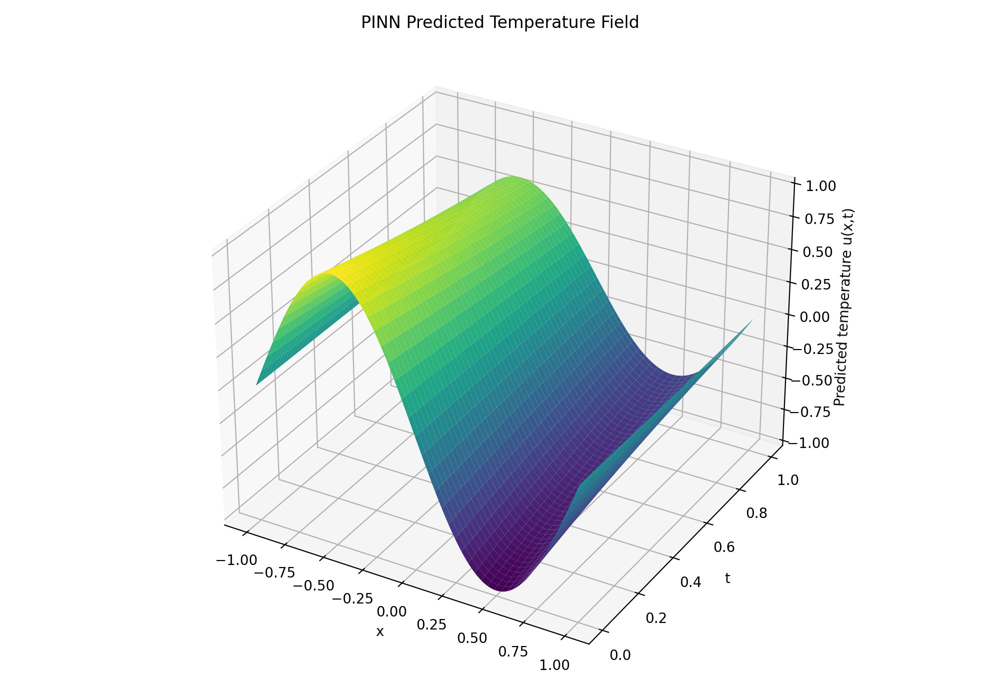

# Fabric Report — PINN Heat Equation Simulation

- mesh-free PINN data generation
- Flax HeatSurrogate neural network
- JAX autodiff physics loss
- Optax Adam training for 5000 epochs
- 3D visualization of the learned temperature field

[Open the interactive 3D PINN fabric](../data/pinn_3d_fabric.html)

- A PINN learns one specific solution instance: it maps coordinates (x,t) to u(x,t) for one fixed initial condition, such as u(x,0) = -sin(pi*x). If the initial condition changes, the PINN usually has to be retrained.
- A Fourier Neural Operator learns an operator between function spaces: it maps an entire input function, such as an initial temperature profile, to an entire output solution function. This makes it suitable for families of PDE solutions, not just one case.
- FNOs use convolutions in the frequency domain to capture global spatial patterns efficiently. Because the learned operator generalizes across different input functions, it can produce zero-shot predictions for new initial conditions without retraining from scratch.
