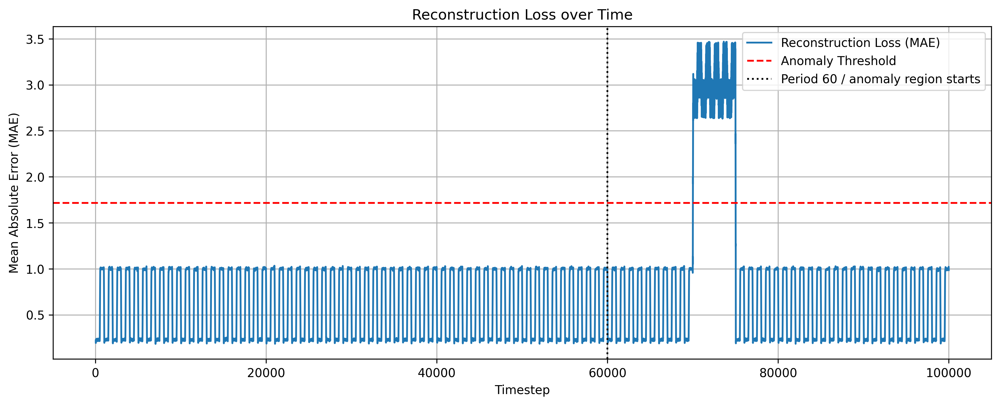

# Agent Report: Simulation Execution Summary

## Operation Details
- **Initiator:** Observer-Prime
- **Target Script:** `src/ancients.py`
- **Status:** Execution Successful

## Physics Systems Simulated
The script simulates a classical **RL (Resistor-Inductor) circuit**. 

### System Dynamics
The system's behavior is governed by the first-order ordinary differential equation (ODE):
$$ I'(t) = V(t) - 0.2 \cdot I(t) $$
Where:
- **$I(t)$**: Current over time
- **$V(t)$**: Time-varying voltage source, defined as $V(t) = 5 \sin(t)$
- **Initial Condition**: $I(0) = 0$

### Simulation Methodology
The simulation compares two different mathematical approaches to solving this physical system:
1. **Continuous Approach**: Utilizes scipy's `solve_ivp` for a high-accuracy baseline.
2. **Discrete Approach**: Implements the Explicit Euler Method. The simulation tests the system under two scenarios to demonstrate numerical stability:
   - **Stable Case:** Small time step ($dt = 0.1$), resulting in an accurate approximation of the continuous model.
   - **Sabotaged/Unstable Case:** Excessively large time step ($dt = 11$), causing the discrete numerical approximation to break down.

## Output Verification
The resulting visualization was successfully generated and has been verified. The output file `exercise3_rl_plot.png` is confirmed to be safely stored in the `data/` directory as requested.

---

# Anomaly Detection with PhysicsAutoencoder

## Experiment Summary

1. The 1D corrupted signal was sliced into **50-timestep overlapping windows**.
2. The **PhysicsAutoencoder** was trained only on the normal data before **period 60**.
3. The full dataset, including the corrupted region, was passed through the trained model.
4. The **reconstruction loss** was calculated using **Mean Absolute Error (MAE)**.
5. The anomaly is visible as a **strong spike** in the reconstruction loss plot.

## Reconstruction Loss

> The spike between periods 70–75 corresponds to the injected high-frequency sabotage. The autoencoder, having only learned normal signal patterns, produces high reconstruction error in the corrupted region.

## Architecture Review

- **Gemini** reviewed the initial dense-layer PhysicsAutoencoder architecture.
- Gemini suggested replacing the dense encoder/decoder with **Conv1D** and **Conv1DTranspose** layers to better capture local temporal patterns in the signal windows.
- The revised convolutional architecture is implemented in `src/architecture_gemini.py`.

## PINN Heat Equation Fabric

- A mesh-free PINN dataset was generated using random collocation, IC, and BC points.
- A Flax Linen MLP named HeatSurrogate was implemented.
- The heat equation residual u_t - alpha*u_xx was enforced using JAX automatic differentiation.
- The model was trained with Optax Adam for 5000 epochs.
- A static 3D surface plot and an interactive Plotly visualization were created.
- [docs/Fabric_Report.md](docs/Fabric_Report.md)
- [data/pinn_3d_fabric.html](data/pinn_3d_fabric.html)