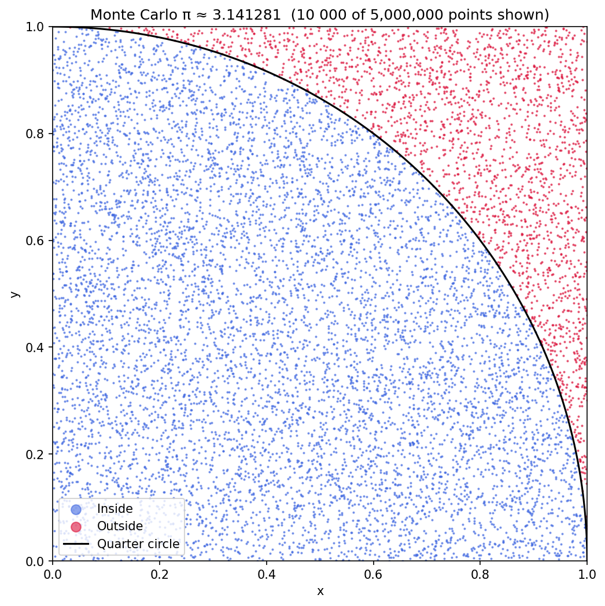
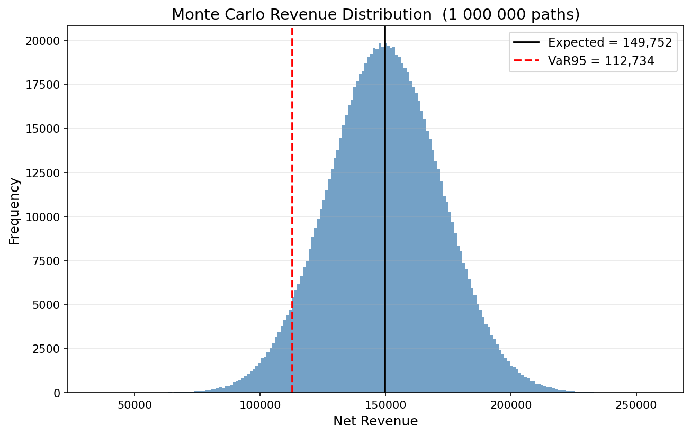
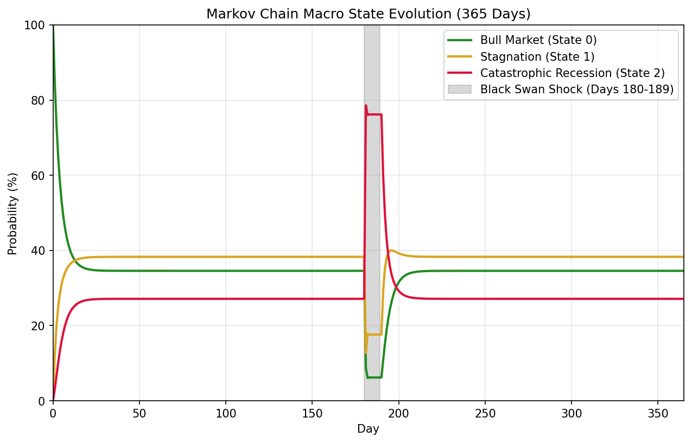

# Agent Report: Simulation Execution Summary

## Operation Details
- **Initiator:** Observer-Prime
- **Target Script:** `src/ancients.py`
- **Status:** Execution Successful

## Physics Systems Simulated
The script simulates a classical **RL (Resistor-Inductor) circuit**. 

### System Dynamics
The system's behavior is governed by the first-order ordinary differential equation (ODE):
$$ I'(t) = V(t) - 0.2 \cdot I(t) $$
Where:
- **$I(t)$**: Current over time
- **$V(t)$**: Time-varying voltage source, defined as $V(t) = 5 \sin(t)$
- **Initial Condition**: $I(0) = 0$

### Simulation Methodology
The simulation compares two different mathematical approaches to solving this physical system:
1. **Continuous Approach**: Utilizes scipy's `solve_ivp` for a high-accuracy baseline.
2. **Discrete Approach**: Implements the Explicit Euler Method. The simulation tests the system under two scenarios to demonstrate numerical stability:
   - **Stable Case:** Small time step ($dt = 0.1$), resulting in an accurate approximation of the continuous model.
   - **Sabotaged/Unstable Case:** Excessively large time step ($dt = 11$), causing the discrete numerical approximation to break down.

## Output Verification
The resulting visualization was successfully generated and has been verified. The output file `exercise3_rl_plot.png` is confirmed to be safely stored in the `data/` directory as requested.

---

# Anomaly Detection with PhysicsAutoencoder

## Experiment Summary

1. The 1D corrupted signal was sliced into **50-timestep overlapping windows**.
2. The **PhysicsAutoencoder** was trained only on the normal data before **period 60**.
3. The full dataset, including the corrupted region, was passed through the trained model.
4. The **reconstruction loss** was calculated using **Mean Absolute Error (MAE)**.
5. The anomaly is visible as a **strong spike** in the reconstruction loss plot.

## Reconstruction Loss

> The spike between periods 70–75 corresponds to the injected high-frequency sabotage. The autoencoder, having only learned normal signal patterns, produces high reconstruction error in the corrupted region.

## Architecture Review

- **Gemini** reviewed the initial dense-layer PhysicsAutoencoder architecture.
- Gemini suggested replacing the dense encoder/decoder with **Conv1D** and **Conv1DTranspose** layers to better capture local temporal patterns in the signal windows.
- The revised convolutional architecture is implemented in `src/architecture_gemini.py`.

## PINN Heat Equation Fabric

This week's progress involved building and training a Physics-Informed Neural Network to solve the 1D heat equation. We successfully generated a mesh-free dataset using random sampling for collocation, initial condition, and boundary condition points. To approximate the temperature field, we implemented a `HeatSurrogate` model using Flax Linen. 

A core component of the project was enforcing the PDE physics; we achieved this by computing the exact heat equation residual using JAX automatic differentiation for the physics loss. The network was then trained using the Optax Adam optimizer for 5000 epochs. Finally, to analyze the results, we generated both a static 3D surface plot and an interactive Plotly HTML visualization.

- [Read the detailed Fabric Report](docs/Fabric_Report.md)
- [View the Interactive 3D PINN Visualization](data/pinn_3d_fabric.html)

---

## Problem Set 6: Chaos Engine

**Project Overview:** This project leverages Monte Carlo simulation, JAX vectorization, Antigravity subagent workflow analysis, and Markov Chain shock modeling to analyze revenue risks and system behavior under volatility.

### Exercise 1: Classical NumPy Pi Estimation
A classical Monte Carlo approach implemented in `src/classical_pi.py`. As recorded in the [submission log](docs/submission_log.md), the estimation reached a robust approximation.

### Exercise 2: JAX Monte Carlo Revenue Simulation
Using JAX vectorization in `src/monte_carlo.py`, we simulated 1,000,000 paths in parallel. The [submission log](docs/submission_log.md) records the expected revenue and VaR95 threshold.

### Exercise 3: Agentic Automation via Antigravity Skills
We deployed an Alpha Stress Tester and a Beta Profiler to analyze our revenue model. The [Swarm Stress Report](docs/Swarm_Stress_Report.md) details the findings:
- **Alpha Stress Tester:** The Value-at-Risk (VaR95) breaks and drops below zero around a cost volatility of $\sigma \approx 4.0$.
- **Beta Profiler:** Using in-process JAX profiling, we observed a 5.1× speedup when comparing the cold execution (trace and compile) to the warm execution (cached kernel).

### Exercise 4: Markov Boss Fight
In `src/markov_boss.py` and the accompanying [Markov Boss Summary](docs/markov_boss_summary.md), we model a macroeconomic environment across 365 days.

An unexpected Black Swan shock is introduced from day 180 through day 189. During this 10-day crisis window, the probability mass for Bull Market and Stagnation transitions shifts dramatically, sending 80% of their mass directly into Catastrophic Recession, heavily skewing the macro environment before baseline behavior is restored.

---

## Problem Set 7: The Cerebral Nexus

This problem set integrates Gemini API calls with simulation workflows, visual anomaly detection, structured JSON parameter control, and prompt injection defense. It also includes a structural deep dive into Transformer attention mechanisms and alignment foundations with Tunix/GRPO.

- [Read the Cerebral Nexus Report](docs/Cerebral_Nexus_Report.md)
- Key outputs: Gemini API ping, visual audit plot, closed-loop kappa control logs, defensive prompt injection evaluation, and alignment theory summary.

---

## Problem Set 10: Project Genesis – The Cognitive Core
- [Read ADK Report](docs/ADK_Report.md)